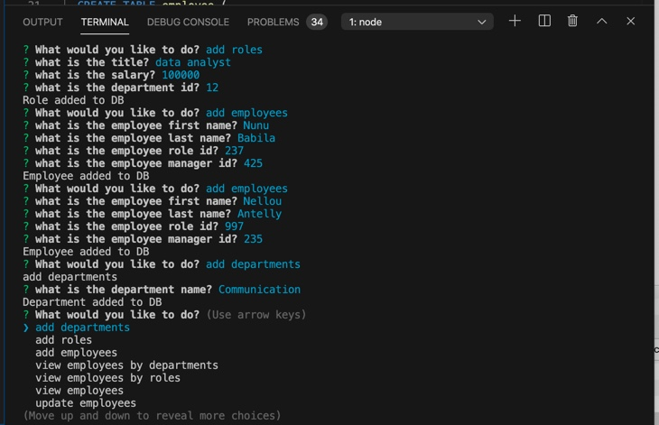
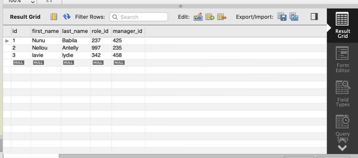

# Employee-Management-

This app is a Content Management System that allows the user to track employees easily. It allows the user to enter new employees per their department or roles, add their salary and their manager. The app alose helps to manage current employees. To use the app, the use has to install all the dependency and copy the database in **Seed.sql** to the **Mysql workbench** in other to create a data base

# Technologies Used

**Node.js**

**NPM**

**Javascript**

**Mysql**

**Github**

# Demo

  **In the terminal**

  

  **Database created on mysql workbench**
  
  

  # Links

[Github repo]()

# Feedback, contact or contribution

[Linkedin](https://www.linkedin.com/in/sandrine-nubia-975aa2172/)

[Portfolio](https://snubia.github.io/portfolioUp/index.html)
